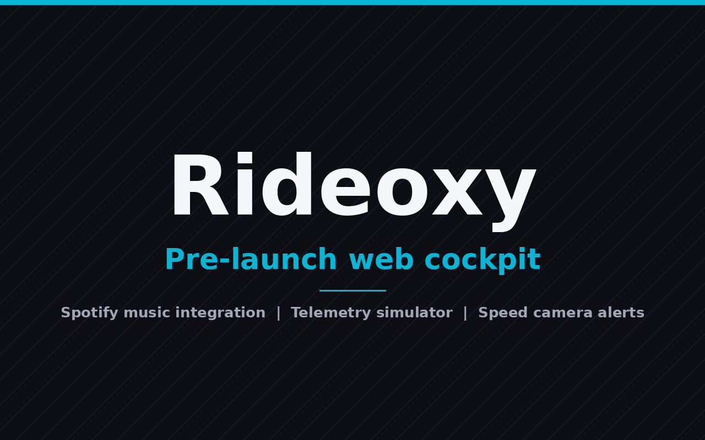

# Rideoxy Web



> Rideoxy is an advanced motorcycle telemetry, navigation intelligence, and audio cockpit engine for two wheels, and this repo is its pre-launch web platform and interactive simulator, letting riders see and feel the cockpit experience now while the native mobile apps and hardware sensor integrations are under active development.

 

> **Notice:** This repository contains the official **Rideoxy Pre-Launch Web Platform & Interactive Simulator**. The full native mobile applications (iOS & Android) and hardware sensor integrations are currently under active development.

## Features

- **Spotify Web API Intercom Cockpit**: Discord-style OAuth 2.0 PKCE login through Spotify's official screen with zero developer setup for visitors, live currently playing telemetry (album artwork, song, artist, album, progress scrubber, play/pause status), speed-adaptive volume boost of +15% at speeds of 100 km/h and above, radar warning auto-ducking of -12 dB on speed camera alerts, curated rider playlists, and a recently played list.
- **Post-Ride Telemetry & ETA Pace Delta**: Pace comparison of actual ride duration against initial Maps ETA estimates, plus velocity curve and analytics tracking distance, top speed, average speed, max lean angle, and ride smoothness score.
- **Mounting-Independent Gyroscope Calibration**: 6-axis sensor fusion that auto-zeroes pitch offsets whether the device is on handlebars, in a tank bag, or in a jacket pocket, with an interactive cornering lean angle HUD simulator computing lateral G-forces and traction safety thresholds.
- **Speed Camera Radar Alerts**: Real-time warnings for highway speed cameras, enforcement zones, and local speed limit thresholds.
- **Multiplayer & Friends Leaderboard**: Crew rankings comparing weekly distance, top speed, max lean angles, and smoothness scores with your riding group.
- **Tour & Fuel Intelligence Calculator**: Trip cost estimator calculating total fuel consumption (km/L), estimated cost, and required fuel stops based on machine profiles (e.g., Royal Enfield Hunter 350, Bajaj Dominar 400, Honda CB350).

## Tech Stack

      

- **Frontend Core**: React 19, TypeScript, Vite 8
- **Styling**: Tailwind CSS v4, Vanilla CSS Design System, Glassmorphism UI
- **Animations & Graphics**: GSAP (GreenSock), Three.js / OGL (WebGL Hyperspeed & TubesCursor interactive canvas)
- **Icons**: Lucide React
- **Audio & Telemetry API**: Spotify Web API OAuth 2.0 (PKCE Authorization Code Flow)
- **Backend Proxy Server (Optional)**: Node.js, Express, Cookie-Parser, CORS

### Why This Stack

- **React 19 + TypeScript**: component-driven cockpit HUDs with type safety across telemetry state.
- **Vite**: fast dev server and production builds for the single-page app.
- **Tailwind CSS v4 + Vanilla CSS**: the glassmorphism design system behind the cockpit UI.
- **GSAP + Three.js / OGL**: the interactive WebGL canvases (HyperSpeed, TubesCursor) and animations used in the pre-launch showcase.
- **Spotify Web API with PKCE**: streams the rider's own music into the cockpit without exposing secrets or passwords to the browser.
- **Express proxy server (server/ + api/)**: handles the Spotify OAuth exchange and keeps the client secret server-side.
- **Lucide React**: one consistent icon set across every HUD.

## How It Works

- The Vite single-page app renders the cockpit: Spotify music, lean angle simulator, navigation alerts, post-ride summary, sensor calibration, multiplayer leaderboard, and trip calculator.
- Spotify login flows through the Express proxy or the Vercel API routes using the OAuth 2.0 PKCE authorization code flow; tokens are held server-side in cookies.
- Currently playing, playback controls, and recently played data are all fetched through the proxy, so the client secret never reaches the browser.
- Lean angle, speed, and pace analytics are computed client-side in the interactive simulator. Real sensor hardware arrives with the future mobile apps.
- Legal pages (privacy, terms, cookies) and a cookie consent banner ship with the frontend.

## Upcoming Mobile App & Hardware Roadmap (Future Release)

The Rideoxy ecosystem is expanding into a full hardware & mobile suite:

-  **Native iOS & Android Mobile Apps**: High-frequency background GPS & IMU logging.
-  **Bluetooth 5.3 IMU Hardware Node**: Dedicated low-latency 6-axis IMU sensor pod for ultra-precise lean angle capture.
-  **ECU OBD-II Data Integration**: Real-time RPM, throttle position (WOT), gear selection, and engine temperature telemetry.
-  **Helmet Intercom Mesh Sync**: Voice HUD navigation alerts and group rider voice mesh integration.
-  **Rideoxy Cloud Vault**: Cloud route sharing, twisties discovery, and telemetry archiving.

## Quick Start

### Prerequisites

- **Node.js**: v18.0 or higher (recommended; npm ships with Node.js)
- **React**: 19 (per `package.json`)
- **TypeScript**: 6.x (per `package.json`)
- **Vite**: 8 (per `package.json`)
- **Tailwind CSS**: v4 (per `package.json`)
- A Spotify developer app (for the music cockpit features)

### Installation

1. **Clone the repository:**
   ```bash
   git clone https://github.com/p3xz/brovxi-web.git
   cd brovxi-web
   ```

2. **Install dependencies:**
   ```bash
   npm install
   ```

3. **Configure environment variables:**
   ```bash
   cp .env.example .env
   ```
   Fill in `SPOTIFY_CLIENT_ID`, `SPOTIFY_CLIENT_SECRET`, and `SPOTIFY_REDIRECT_URI` in `.env` with your own credentials from the [Spotify Developer Dashboard](https://developer.spotify.com/dashboard). Make sure to register the redirect URI under Redirect URIs in your Spotify Dashboard (see the Configuration section below).

4. **Start the development server:**
   ```bash
   npm run dev
   ```
   This starts both the Express proxy server and the Vite dev server (via concurrently). Open `http://localhost:5173/` in your browser.

5. **Build for production:**
   ```bash
   npm run build
   ```

## Usage

Start the app and open it in your browser:

```bash
npm run dev
```

Then go to `http://localhost:5173/`, connect your Spotify account on the login screen, and try the intercom cockpit, lean angle simulator, and post-ride telemetry from the navigation.

## Configuration

| Variable | Description | Default | Required |
| --- | --- | --- | --- |
| `SPOTIFY_CLIENT_ID` | Client ID of your Spotify application from the Spotify Developer Dashboard | None | Yes |
| `SPOTIFY_CLIENT_SECRET` | Client secret of your Spotify application; kept server-side by the proxy | None | Yes |
| `SPOTIFY_REDIRECT_URI` | OAuth callback URL registered under Redirect URIs in your Spotify Dashboard | None | Yes |

Never commit your `.env` file: real secret values stay local and must not be checked into git.

## Contributing

Pull requests are welcome. For major changes, please open an issue first to discuss what you would like to change.

## License

This project is licensed under the MIT License, copyright (c) 2026 p3xz. See the [LICENSE](LICENSE) file for the full text.

## Contact & Creator

- **Creator:** Namish Yadav
- **GitHub:** [https://github.com/p3xz](https://github.com/p3xz)
- **LinkedIn:** [https://www.linkedin.com/in/namish-yadav-639769408/](https://www.linkedin.com/in/namish-yadav-639769408/)
- **Instagram:** [@nam7sh](https://instagram.com/nam7sh)
- **Email:** `contactphoenixfy@gmail.com`

---

<p align="center">
  <strong>One ride. One experience. Rideoxy. </strong>
</p>
